# Lev Agent Ecosystem Map

This document maps the Lev ecosystem using:
- Railway deployment topology (all 9 projects).
- `codebase-memory-mcp` cross-repo graph index + 3D UI.

Generated on 2026-06-30.

## 3D Graph

- UI endpoint: `http://localhost:9749`
- Binary: `codebase-memory-mcp 0.8.1`
- Indexed projects in shared store: 13

```mermaid
flowchart LR
  subgraph rail [RailwayProjects]
    p1[agentyx-specialists]
    p2[finu-platform]
    p3[twenty-crm-erp-next]
    p4[client-core-agentyx]
    p5[client-montblanc-agentyx]
    p6[litellm-langfuse]
    p7[template-client-agentyx-crew]
    p8[cost-monitoring]
    p9[client-demo-agentyx]
  end

  subgraph repos [IndexedCodeRepos]
    r1[portal-stack]
    r2[core-dashboard]
    r3[lev-crewai-agent-template]
    r4[api_agents_client_lev]
    r5[finu-cp]
    r6[lev-livekit-agent-template]
    r7[lev-agent-browser]
    r8[agentyx-artifact-renderer]
    r9[agentyx-composio-mcp]
    r10[lev-virtual-office]
    r11[finu-ml-credit]
    r12[fintech-saas]
    r13[lev-cost-portal]
  end

  subgraph graph [CodebaseMemoryStore]
    g1[CrossRepoKnowledgeGraph]
    g2[UI_9749]
  end

  rail --> repos
  repos --> g1
  g1 --> g2
```



## Railway Topology Summary

| Railway project | Services | App services (repo-backed) | Infra services |
|---|---:|---:|---:|
| `agentyx-specialists` | 12 | 6 | 6 |
| `finu-platform` | 14 | 10 | 4 |
| `twenty-crm-erp-next` | 15 | 1 | 14 |
| `client-core-agentyx` | 24 | 17 | 7 |
| `client-montblanc-agentyx` | 19 | 6 | 13 |
| `litellm-langfuse` | 9 | 0 | 9 |
| `template-client-agentyx-crew` | 9 | 6 | 3 |
| `cost-monitoring` | 8 | 6 | 2 |
| `client-demo-agentyx` | 12 | 6 | 6 |

Notes:
- Most deployed agent services point to `levinnovation/lev-crewai-agent-template`.
- Heavy third-party stacks were intentionally not indexed as source repos for this map.

## Verified Core Agent Wiring (Portal -> External Agents)

From `portal-stack` config and graph queries:
- `qara` resolves from `tenants/core/config.ts` via `baseUrlEnv: "QARA_API_URL"`.
- `inteligencia-13` resolves from `tenants/core/config.ts` via `baseUrlEnv: "INTELIGENCIA_API_URL"`.
- API proxy calls route through `src/lib/agents/external-agent.ts`.

Observed `query_graph` `HTTP_CALLS` edges include:
- `/api/agents/qara/run`
- `/api/agents/qara/lead/:cid`
- `/api/agents/inteligencia/leads`
- `/api/agents/inteligencia-13/run`

Observed `CALLS` edges in API route handlers include:
- `src/app/api/agents/[agentId]/run/route.ts` -> `getExternalAgent`, `runExternalAgentAction`
- `src/app/api/agents/[agentId]/status/[traceId]/route.ts` -> `getExternalAgent`, `getExternalAgentStatus`
- `src/app/api/agents/[agentId]/schedule/route.ts` -> `getExternalAgent`, `getExternalAgentSchedule`

## Key `client-core-agentyx` Service URL Mapping

Sanitized URL-only mapping from `portal-stack` service variables:
- `QARA_API_URL` -> `agent-2-core-ventas-comunicacion-production.up.railway.app`
- `INTELIGENCIA_API_URL` -> `core.bi-da.agentyx.one`
- `RAILWAY_SERVICE_AGENT_9_CORE_KOREN_CUSTOMER_SERVICE_URL` -> `core.koren.agentyx.one`
- `RAILWAY_SERVICE_AGENT_13_INTELIGENCIA_COMERCIAL_URL` -> `core.bi-da.agentyx.one`
- `RAILWAY_SERVICE_CORE_DASHBOARD_URL` -> `core-dashboard-production.up.railway.app`
- `RAILWAY_SERVICE__MIDDLEWARE_API_AGENTS_CLIENT_LEV_URL` -> `api.core.agentyx.one`

## Indexed Repos (Shared Graph Store)

- `/Users/vinicioflores/portal-stack`
- `/Users/vinicioflores/lev-fleet/core-dashboard`
- `/Users/vinicioflores/lev-fleet/lev-crewai-agent-template`
- `/Users/vinicioflores/lev-fleet/api_agents_client_lev`
- `/Users/vinicioflores/lev-fleet/finu-cp`
- `/Users/vinicioflores/lev-fleet/lev-livekit-agent-template`
- `/Users/vinicioflores/lev-fleet/lev-agent-browser`
- `/Users/vinicioflores/lev-fleet/agentyx-artifact-renderer`
- `/Users/vinicioflores/lev-fleet/agentyx-composio-mcp`
- `/Users/vinicioflores/lev-fleet/lev-virtual-office`
- `/Users/vinicioflores/lev-fleet/finu-ml-credit`
- `/Users/vinicioflores/lev-fleet/fintech-saas`
- `/Users/vinicioflores/lev-fleet/lev-cost-portal`

## Rebuild Commands

```bash
/Users/vinicioflores/.local/bin/codebase-memory-mcp config set auto_index true
/Users/vinicioflores/.local/bin/codebase-memory-mcp --ui=true --port=9749
/Users/vinicioflores/.local/bin/codebase-memory-mcp cli list_projects '{}'
```

