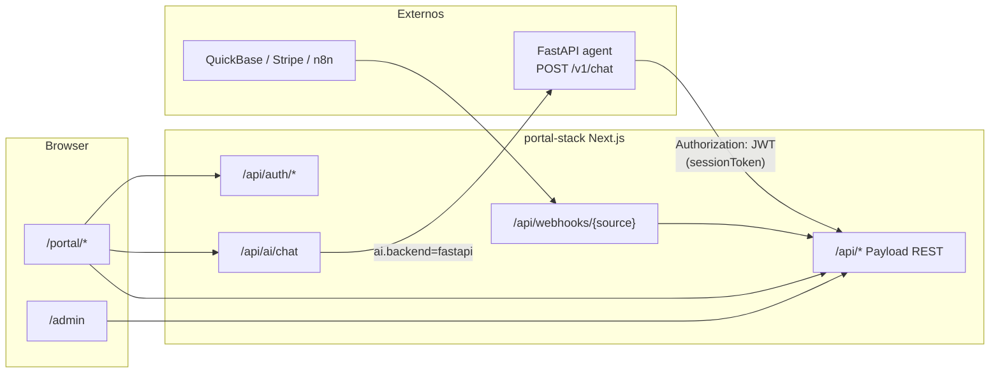

# Guía de integración API

portal-stack actúa como **BFF** (Backend for Frontend) + **Payload CMS**: el portal Next.js expone REST, auth con cookie JWT, webhooks y un proxy de chat hacia agentes **FastAPI** externos.

Deploy: [RAILWAY.md](./RAILWAY.md) · Fork local: [FORK.md](./FORK.md).

---

## Arquitectura



| Capa | Rol |
|------|-----|
| **Payload REST** (`/api/*`) | CRUD collections: users, pages, datasets, documents, … |
| **Rutas custom** (`src/app/api/`) | Login, chat, webhooks, forms |
| **FastAPI** | Lógica de agente pesada (tools propios, RAG, LLM) cuando `ai.backend=fastapi` |
| **Tenant sources** (`tenants/<id>/sources/`) | Lecturas server-only a APIs externas para pantallas custom |

Resolución del backend AI (`src/lib/ai/backend.ts`):

1. `tenants/<id>/config.ts` → `ai.backend`
2. Si no está definido → env `AI_BACKEND`
3. Default → `"local"` (AI SDK en Next.js)

---

## Autenticación

### Cookie de sesión (browser)

| Item | Valor |
|------|--------|
| Cookie | `payload-token` (default; override con `AUTH_COOKIE_NAME`) |
| Emisión | `POST /api/auth/login` |
| Validación edge | `src/middleware.ts` — solo **presencia** de cookie en `/portal/*` |
| Validación server | Payload JWT vía `LocalPayloadAuthProvider` |

**Login (portal):**

```bash
curl -c cookies.txt -X POST https://portal.example.com/api/auth/login \
  -H "Content-Type: application/json" \
  -d '{"email":"admin@example.com","password":"secret"}'
# → {"ok":true,"redirect":"/portal/admin"}
# Set-Cookie: payload-token=...
```

**Sign out:**

```bash
curl -b cookies.txt -X POST https://portal.example.com/api/auth/signout
```

**Middleware:** rutas bajo `/portal/auth` están exentas; el resto de `/portal/*` redirige a login sin cookie.

### JWT server-to-server (Payload REST)

Para scripts, FastAPI u otros servicios backend:

```bash
TOKEN="<jwt-from-login-or-payload-admin>"

curl https://portal.example.com/api/users/me \
  -H "Authorization: JWT ${TOKEN}"
```

Payload acepta `Authorization: JWT <token>` (mismo valor que la cookie `payload-token`).

**Flujo típico para un agente FastAPI:**

1. El usuario chatea en el portal → `POST /api/ai/chat`
2. portal-stack reenvía `sessionToken` (JWT) en el body a FastAPI
3. FastAPI valida llamando `GET {PORTAL}/api/users/me` con `Authorization: JWT {sessionToken}`
4. FastAPI consulta datos con el mismo JWT (respeta ACL de Payload) o con un service user

### Invitar usuarios (admin)

```bash
curl -b cookies.txt -X POST https://portal.example.com/api/auth/invite \
  -H "Content-Type: application/json" \
  -d '{"email":"user@example.com","password":"temp123","name":"User","role":"customer"}'
```

Requiere sesión con rol `admin` o `superadmin`.

---

## Payload REST API

Montaje: `src/app/(payload)/api/[...slug]/route.ts` — REST estándar Payload 3.

Base URL: `{NEXT_PUBLIC_SERVER_URL}/api`

### Collections clave

| Collection | Uso | Auth |
|------------|-----|------|
| `pages` | Layout builder (dashboards) | Usuario autenticado |
| `datasets` | Queries nombradas para bloques | Usuario autenticado |
| `users` | Portal users | Admin / self |
| `documents`, `media` | Archivos | Según ACL |
| `ai-chats`, `ai-messages` | Historial chat | Usuario autenticado |
| `webhooks` | Audit inbound | Admin |
| `tenants` | Overrides DB del tenant | Superadmin |

Ejemplos:

```bash
# Listar pages (requiere JWT)
curl -H "Authorization: JWT ${TOKEN}" \
  "https://portal.example.com/api/pages?limit=10"

# GraphQL (alternativa)
curl -X POST https://portal.example.com/api/graphql \
  -H "Authorization: JWT ${TOKEN}" \
  -H "Content-Type: application/json" \
  -d '{"query":"{ Pages { docs { slug title } } }"}'
```

Sin auth, endpoints protegidos responden **403**.

### CORS y CSRF

Configurados en `src/payload.config.ts`:

```ts
cors: [process.env.NEXT_PUBLIC_SERVER_URL || "http://localhost:3000"],
csrf: [process.env.NEXT_PUBLIC_SERVER_URL || "http://localhost:3000"],
```

- El admin Payload y fetch desde el **mismo origin** del portal funcionan out of the box
- Si un frontend externo llama REST, debe estar en la lista CORS (hoy: solo `NEXT_PUBLIC_SERVER_URL`)
- FastAPI **no** necesita CORS hacia Payload si las llamadas son **server-side** desde Railway

---

## Proxy de chat AI

**Endpoint portal:** `POST /api/ai/chat`

**Auth:** cookie de sesión (browser) o mismo JWT en escenarios custom.

**Body:**

```json
{
  "messages": [/* UIMessage[] AI SDK */],
  "agentId": "default",
  "chatId": "optional-existing-chat-id"
}
```

**Comportamiento:**

1. Valida sesión y feature `aiAgent`
2. Persiste mensaje usuario en Payload (`ai-chats` / `ai-messages`)
3. Si `resolveAIBackend(tenant.ai) === "fastapi"` → proxy a FastAPI
4. Si `local` → `streamText` AI SDK en Next.js

### Contrato FastAPI

Implementa en tu agente Python:

```
POST {FASTAPI_AGENT_URL}/v1/chat
```

| Header | Valor |
|--------|--------|
| `Authorization` | `Bearer {FASTAPI_AGENT_SECRET}` |
| `Content-Type` | `application/json` |

**Request body** (`src/lib/ai/fastapi-types.ts`):

```typescript
interface FastAPIChatRequest {
  tenantId: string;
  userId: string;
  role: string;
  agentId: string;
  chatId: string;
  messages: UIMessage[];  // AI SDK 5
  sessionToken?: string;  // JWT payload-token — validar en portal
}
```

**Response:** `text/event-stream` — stream UIMessage AI SDK; el portal lo reenvía al cliente y persiste la respuesta del asistente.

**Errores:**

| Status | Significado |
|--------|-------------|
| 503 | `FASTAPI_AGENT_URL` / `SECRET` missing o red caída |
| 502/4xx | Respuesta error del upstream (detail en JSON) |

Opt-in fallback: `AI_BACKEND_FALLBACK=local` reintenta con AI SDK local solo en 503.

### Variables

```env
AI_BACKEND=fastapi
FASTAPI_AGENT_URL=https://your-agent.up.railway.app
FASTAPI_AGENT_SECRET=shared-secret
FASTAPI_AGENT_TIMEOUT_MS=30000
```

O en tenant: `tenants/<id>/config.ts` → `ai: { backend: "fastapi", ... }`.

---

## Webhooks entrantes

**Endpoint:** `POST /api/webhooks/{source}`

Sources reconocidos en el processor: `quickbase`, `stripe`, `n8n`, `agentyx`, `other` (extensible en `src/lib/integrations/process-webhook.ts`).

**Seguridad opcional:**

```bash
curl -X POST https://portal.example.com/api/webhooks/quickbase \
  -H "Content-Type: application/json" \
  -H "x-webhook-secret: ${WEBHOOK_SECRET}" \
  -H "x-webhook-event: record.updated" \
  -d '{"event":"record.updated","table":"bqxxx","recordId":"123","fields":{}}'
```

Si `WEBHOOK_SECRET` está definido, el header `x-webhook-secret` debe coincidir.

Flujo:

1. Registro en collection `webhooks` (status `received`)
2. `processWebhook()` — sync QuickBase, audit log, etc.
3. Segundo registro con status `processed` / `failed`

---

## Fuentes por tenant (`tenants/<id>/sources/`)

Patrón para pantallas custom (Server Components) que leen APIs externas **sin** exponer tokens al browser.

```
tenants/core/sources/quickbase.ts   # import "server-only"
tenants/core/sources/hubspot.ts
```

- Secrets: `resolveIntegrationToken("quickbase")` → `INTEGRATION_<TENANT>_QUICKBASE_TOKEN`
- Ver `tenants/_default/sources/README.md`
- Pantallas: `tenants/<id>/screens/*.tsx` importan estos módulos

No son endpoints HTTP públicos: son módulos internos del BFF.

---

## Ejemplo: FastAPI en Railway llamando al portal

Servicio **agent** (Python) y servicio **portal** (este repo) en el mismo project Railway.

### 1. Validar sesión del usuario (desde chat proxy)

```python
import httpx

PORTAL = "https://portal-core.up.railway.app"

async def validate_session(session_token: str) -> dict:
    r = await httpx.AsyncClient().get(
        f"{PORTAL}/api/users/me",
        headers={"Authorization": f"JWT {session_token}"},
        timeout=10,
    )
    r.raise_for_status()
    return r.json()["user"]
```

### 2. Handler `/v1/chat` (esqueleto)

```python
from fastapi import FastAPI, Header, HTTPException
from fastapi.responses import StreamingResponse

app = FastAPI()
SECRET = os.environ["FASTAPI_AGENT_SECRET"]

@app.post("/v1/chat")
async def chat(
    body: ChatRequest,
    authorization: str = Header(...),
):
    if authorization != f"Bearer {SECRET}":
        raise HTTPException(401)
    user = await validate_session(body.sessionToken)
    # user["role"] scopea tools...
    return StreamingResponse(ai_sdk_stream(...), media_type="text/event-stream")
```

### 3. Service account (batch / cron)

1. Login una vez: `POST /api/auth/login` → guarda JWT
2. Renueva antes de expirar (`sessionDays` en tenant config, default 7)
3. Usa `Authorization: JWT` en todas las llamadas REST

Para operaciones admin, crea un user `admin` dedicado al agente.

### 4. Llamar datasets vía REST

Los bloques del portal resuelven datasets server-side. Un agente puede leer la misma data vía collections o endpoints custom:

```bash
curl -H "Authorization: JWT ${TOKEN}" \
  "https://portal.example.com/api/projects?limit=5"
```

(nombres de collection según vertical del tenant, p.ej. `projects` en core real estate)

---

## Rutas custom (`src/app/api/`)

| Método | Ruta | Auth | Descripción |
|--------|------|------|-------------|
| POST | `/api/auth/login` | — | Email/password → cookie JWT |
| POST | `/api/auth/signout` | cookie | Cierra sesión |
| POST | `/api/auth/invite` | admin | Crea usuario |
| POST | `/api/auth/reset-request` | — | Stub reset password |
| POST | `/api/ai/chat` | cookie/JWT | Stream chat |
| POST | `/api/webhooks/[source]` | secret opcional | Inbound integrations |
| POST | `/api/forms/excel-upload` | sesión | Carga Excel |

Payload admin + REST viven bajo `(payload)`:

| Ruta | Descripción |
|------|-------------|
| `/admin` | UI Payload |
| `/api/*` | REST collections |
| `/api/graphql` | GraphQL |

---

## Checklist integración

- [ ] `NEXT_PUBLIC_SERVER_URL` = URL real del portal
- [ ] FastAPI: `POST /v1/chat` + Bearer secret + SSE
- [ ] FastAPI: validar `sessionToken` con `/api/users/me`
- [ ] Webhooks: `WEBHOOK_SECRET` en producción
- [ ] Tokens: `INTEGRATION_<TENANT>_<SOURCE>_TOKEN` en Railway
- [ ] `pnpm self-check` antes de deploy

---

## Referencia de código

| Tema | Archivo |
|------|---------|
| Proxy FastAPI | `src/lib/ai/fastapi-proxy.ts` |
| Cliente / URL / headers | `src/lib/ai/fastapi-client.ts` |
| Tipos request | `src/lib/ai/fastapi-types.ts` |
| Route chat | `src/app/api/ai/chat/route.ts` |
| Auth provider | `src/lib/auth/provider.ts` |
| Middleware portal | `src/middleware.ts` |
| Webhooks | `src/app/api/webhooks/[source]/route.ts` |
| CORS Payload | `src/payload.config.ts` |
